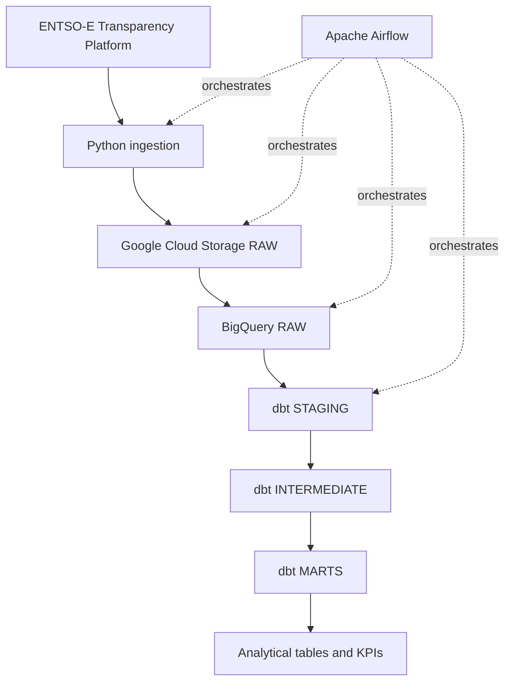

# European Energy Data Platform

A production-style cloud ELT data platform for European electricity data.

The project is designed to ingest electricity data from the ENTSO-E Transparency Platform, preserve raw source payloads in Google Cloud Storage, load structured data into BigQuery, transform it with dbt, and orchestrate the end-to-end workflow with Apache Airflow.

## Project goals

The project demonstrates practical Data Engineering skills around:

- API ingestion with Python;
- incremental and date-driven pipelines;
- Apache Airflow orchestration;
- Docker-based local environments;
- Google Cloud Storage;
- BigQuery;
- dbt transformations;
- data quality and automated testing;
- idempotent processing and backfills;
- CI with GitHub Actions;
- secure management of credentials and secrets.

## Data scope

The initial scope covers electricity data for:

- France;
- Germany;
- Spain;
- Italy.

The MVP focuses on:

- actual electricity load;
- actual generation by production type;
- day-ahead electricity prices.

The primary data source is the ENTSO-E Transparency Platform.

## Target architecture



See [docs/architecture.md](docs/architecture.md) for the detailed architecture and design principles.

## Technology stack

### Core

- Python 3.12
- Apache Airflow
- Docker / Docker Compose
- Google Cloud Storage
- BigQuery
- dbt Core
- SQL

### Engineering quality

- pytest
- Ruff
- Git / GitHub
- GitHub Actions

### Optional extensions

- Terraform
- Looker Studio

Optional technologies will only be introduced if they add clear architectural or analytical value.

## Current status

Project foundation is in progress.

Implemented so far:

- Git repository and feature-branch workflow;
- Python `src/` package layout;
- explicit Python build configuration;
- isolated virtual environment;
- pytest configuration and package import smoke test;
- Ruff linting and formatting;
- `.gitignore` for local artifacts, credentials, Airflow, dbt, and Terraform;
- `.env.example` for the ENTSO-E API token;
- initial architecture documentation.

Not yet implemented:

- ENTSO-E ingestion client;
- raw file persistence;
- Airflow DAGs;
- Google Cloud resources;
- BigQuery loading;
- dbt models;
- CI pipeline.

## Local development

Create and activate a virtual environment:

```bash
python3 -m venv .venv
source .venv/bin/activate
```

Install the project and development dependencies:

```bash
python -m pip install -e '.[dev]'
```

Run the current quality checks:

```bash
python -m pytest
ruff check .
ruff format --check .
git diff --check
```

## Configuration and secrets

Real credentials must never be committed to Git.

The repository contains `.env.example` only as a configuration template:

```text
ENTSOE_API_TOKEN=
```

A real local `.env` file is ignored by Git.

Google Cloud credentials will be configured later using an approach that avoids committing service-account keys or other sensitive material.

## Design principles

The project follows several core engineering principles:

- explicit logical dates instead of relying on wall-clock time;
- deterministic raw storage paths;
- safe reruns for the same data interval;
- UTC as the canonical pipeline timezone;
- clear separation between raw, staging, intermediate, and marts layers;
- raw source preservation for reproducible reprocessing;
- small, reviewable Git commits;
- no unnecessary infrastructure or technologies.

## Repository structure

```text
.
├── docs/
│   └── architecture.md
├── src/
│   └── european_energy_data_platform/
│       └── __init__.py
├── tests/
│   └── test_package.py
├── .env.example
├── .gitignore
├── pyproject.toml
└── README.md
```

The repository structure will evolve incrementally as each pipeline component is implemented.
