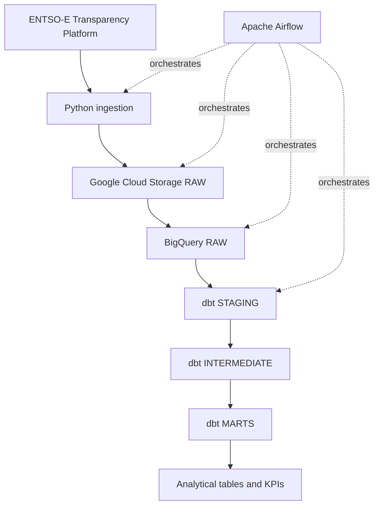

# European Energy Data Platform

A production-style cloud ELT data platform for European electricity data.

The project is designed to ingest electricity data from the ENTSO-E Transparency Platform, preserve raw source payloads in Google Cloud Storage, load structured data into BigQuery, transform it with dbt, and orchestrate the end-to-end workflow with Apache Airflow.

## Project goals

The project demonstrates practical Data Engineering skills around:

- API ingestion with Python;
- incremental and date-driven pipelines;
- Apache Airflow orchestration;
- Docker-based local environments;
- Google Cloud Storage;
- BigQuery;
- dbt transformations;
- data quality and automated testing;
- idempotent processing and backfills;
- CI with GitHub Actions;
- secure management of credentials and secrets.

## Data scope

The initial scope covers electricity data for:

- France;
- Germany;
- Spain;
- Italy.

The MVP focuses on:

- actual electricity load;
- actual generation by production type;
- day-ahead electricity prices.

The primary data source is the ENTSO-E Transparency Platform.

## Target architecture



See [docs/architecture.md](docs/architecture.md) for the detailed architecture and design principles.

## Technology stack

### Core

- Python 3.12
- Apache Airflow
- Docker / Docker Compose
- Google Cloud Storage
- BigQuery
- dbt Core
- SQL

### Engineering quality

- pytest
- Ruff
- Git / GitHub
- GitHub Actions

### Optional extensions

- Terraform
- Looker Studio

Optional technologies will only be introduced if they add clear architectural or analytical value.

## Current status

The project currently implements the source ingestion, immutable GCS RAW landing zone, and structured BigQuery RAW loading layers.

Implemented so far:

- Git repository with feature-branch, pull-request, and CI workflow;
- Python `src/` package layout and explicit build configuration;
- ENTSO-E Web API client for:
  - actual total load;
  - actual generation by production type;
  - day-ahead prices;
- timezone-aware UTC request periods and validation;
- bounded HTTP retries for transient ENTSO-E failures;
- deterministic RAW object naming by dataset, bidding zone, and logical interval;
- extraction functions returning immutable `RawPayload` objects;
- Google Cloud Storage RAW persistence through the official Python SDK;
- create-only GCS writes using `if_generation_match=0`;
- idempotent reruns that preserve the first stored RAW payload;
- Application Default Credentials for local Google Cloud authentication;
- a secured GCS RAW bucket using:
  - the `EU` multi-region;
  - `STANDARD` storage;
  - uniform bucket-level access;
  - public access prevention;
  - seven-day soft delete;
- real end-to-end smoke tests from ENTSO-E to GCS for all three MVP datasets;
- source-aligned XML parsing into point-level RAW records for all three MVP datasets;
- BigQuery RAW provisioning for the `entsoe_raw` dataset and three partitioned and clustered tables;
- deterministic BigQuery load jobs using `WRITE_APPEND` and `CREATE_NEVER`;
- BigQuery rerun handling that recovers an existing deterministic load job on conflict;
- real BigQuery data validation with:
  - 4 actual-load rows;
  - 57 actual-generation rows across 15 source TimeSeries;
  - 190 day-ahead-price rows across two source TimeSeries;
- real BigQuery rerun validation confirming unchanged row counts for all three datasets;
- pytest and Ruff quality checks;
- GitHub Actions CI on pull requests and pushes to `main`;
- `.env.example` for local configuration without committing secrets.

Not yet implemented:

- Apache Airflow DAGs;
- dbt staging, intermediate, and marts models;
- analytical KPIs and downstream visualization.

## Local development

Create and activate a virtual environment:

```bash
python3 -m venv .venv
source .venv/bin/activate
```

Install the project and development dependencies:

```bash
python -m pip install -e '.[dev]'
```

Run the current quality checks:

```bash
python -m pytest
ruff check .
ruff format --check .
git diff --check
```

## Configuration and secrets

Real credentials must never be committed to Git.

The repository contains `.env.example` only as a configuration template:

```text
ENTSOE_API_TOKEN=
GCS_RAW_BUCKET=
```

A real local `.env` file is ignored by Git.

Local Google Cloud authentication uses Application Default Credentials rather than a committed service-account key:

```bash
gcloud auth application-default login
```

The Python Google Cloud client libraries resolve these credentials automatically at runtime.

## Design principles

The project follows several core engineering principles:

- explicit logical dates instead of relying on wall-clock time;
- deterministic raw storage paths;
- safe reruns for the same data interval;
- UTC as the canonical pipeline timezone;
- clear separation between raw, staging, intermediate, and marts layers;
- raw source preservation for reproducible reprocessing;
- small, reviewable Git commits;
- no unnecessary infrastructure or technologies.

## Repository structure

```text
.
├── .github/
│   └── workflows/
│       └── ci.yml
├── docs/
│   └── architecture.md
├── src/
│   └── european_energy_data_platform/
│       ├── __init__.py
│       ├── bigquery_raw.py
│       ├── entsoe.py
│       ├── gcs.py
│       ├── ingestion.py
│       └── parsing.py
├── tests/
│   ├── fixtures/
│   │   ├── actual_generation.xml
│   │   ├── actual_load.xml
│   │   └── day_ahead_prices.xml
│   ├── test_bigquery_loader.py
│   ├── test_bigquery_raw.py
│   ├── test_entsoe.py
│   ├── test_gcs.py
│   ├── test_ingestion.py
│   ├── test_package.py
│   └── test_parsing.py
├── .env.example
├── .gitignore
├── pyproject.toml
└── README.md
```

The repository structure will continue to evolve incrementally as Airflow, dbt, and downstream analytics are introduced.
