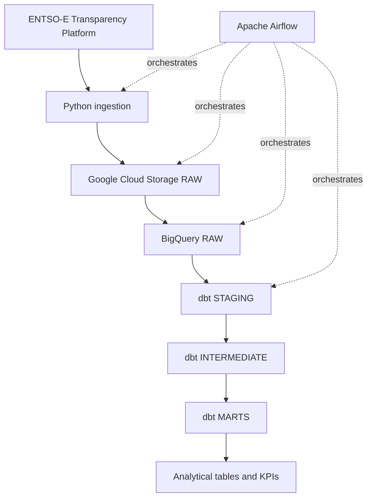

# European Energy Data Platform

A production-style cloud ELT data platform for European electricity data.

The project is designed to ingest electricity data from the ENTSO-E Transparency Platform, preserve raw source payloads in Google Cloud Storage, load structured data into BigQuery, transform it with dbt, and orchestrate the end-to-end workflow with Apache Airflow.

## Project goals

The project demonstrates practical Data Engineering skills around:

- API ingestion with Python;
- incremental and date-driven pipelines;
- Apache Airflow orchestration;
- Docker-based local environments;
- Google Cloud Storage;
- BigQuery;
- dbt transformations;
- data quality and automated testing;
- idempotent processing and backfills;
- CI with GitHub Actions;
- secure management of credentials and secrets.

## Data scope

The initial scope covers electricity data for:

- France;
- Germany;
- Spain;
- Italy.

The MVP focuses on:

- actual electricity load;
- actual generation by production type;
- day-ahead electricity prices.

The primary data source is the ENTSO-E Transparency Platform.

## Target architecture



See [docs/architecture.md](docs/architecture.md) for the detailed architecture and design principles.

## Technology stack

### Core

- Python 3.12
- Apache Airflow
- Docker / Docker Compose
- Google Cloud Storage
- BigQuery
- dbt Core
- SQL

### Engineering quality

- pytest
- Ruff
- Git / GitHub
- GitHub Actions

### Optional extensions

- Terraform
- Looker Studio

Optional technologies will only be introduced if they add clear architectural or analytical value.

## Current status

The project currently implements the source ingestion, immutable GCS RAW landing
zone, structured BigQuery RAW loading, dbt transformation layers, and Apache
Airflow orchestration.

Implemented so far:

- Git repository with feature-branch, pull-request, and CI workflow;
- Python `src/` package layout and explicit build configuration;
- ENTSO-E Web API client for:
  - actual total load;
  - actual generation by production type;
  - day-ahead prices;
- timezone-aware UTC request periods and validation;
- bounded HTTP retries for transient ENTSO-E failures;
- deterministic RAW object naming by dataset, bidding zone, and logical interval;
- extraction functions returning immutable `RawPayload` objects;
- Google Cloud Storage RAW persistence through the official Python SDK;
- create-only GCS writes using `if_generation_match=0`;
- idempotent reruns that preserve the first stored RAW payload;
- Application Default Credentials for local Google Cloud authentication;
- a secured GCS RAW bucket using:
  - the `EU` multi-region;
  - `STANDARD` storage;
  - uniform bucket-level access;
  - public access prevention;
  - seven-day soft delete;
- real end-to-end smoke tests from ENTSO-E to GCS for all three MVP datasets;
- source-aligned XML parsing into point-level RAW records for all three MVP datasets;
- BigQuery RAW provisioning for the `entsoe_raw` dataset and three partitioned and
  clustered tables;
- deterministic BigQuery load jobs using `WRITE_APPEND` and `CREATE_NEVER`;
- BigQuery rerun handling that recovers an existing deterministic load job on conflict;
- real BigQuery RAW validation with:
  - 4 actual-load rows;
  - 57 actual-generation rows across 15 source TimeSeries;
  - 190 day-ahead-price rows across two source TimeSeries;
- real BigQuery rerun validation confirming unchanged RAW row counts;
- an isolated dbt environment using dbt Core and the BigQuery adapter;
- dbt source definitions for the three BigQuery RAW tables;
- thin staging views for load, generation, and day-ahead prices;
- intermediate models that:
  - normalize ENTSO-E generation bidding-zone direction;
  - deduplicate equivalent day-ahead price TimeSeries within a source object;
  - canonicalize overlapping source extracts at each declared business grain
    using ENTSO-E revision metadata and deterministic technical tie-breakers;
- analytics-ready marts:
  - `fct_actual_load`;
  - `fct_generation_by_type`;
  - `fct_day_ahead_prices`;
- explicit mart grains validated against real ENTSO-E data;
- dbt data-quality coverage with 94 tests across staging, intermediate, and marts;
- real BigQuery canonicalization validation with:
  - 100 staged actual-load rows reduced to 96 canonical observations;
  - 1,446 normalized generation rows reduced to 1,389 canonical observations;
  - 286 deduplicated day-ahead-price rows reduced to 191 canonical observations;
- pytest and Ruff quality checks;
- Apache Airflow 3.3.1 daily orchestration with explicit 24-hour UTC data
  intervals, dynamic task mapping across the 10 target bidding zones, and
  explicit concurrency limits;
- runtime Airflow validation of all three ingestion task families for France
  and of the downstream `run_dbt_build` task;
- GitHub Actions CI for Python quality, cloud-free dbt project validation, and
  cloud-free Airflow DAG validation;
- `.env.example` for local configuration without committing secrets.

Not yet implemented:

- analytical KPIs and downstream visualization.

## Local development

Create and activate the application virtual environment:

```bash
python3 -m venv .venv
source .venv/bin/activate
```

Install the application and development dependencies:

```bash
python -m pip install -e '.[dev]'
```

Create the isolated dbt virtual environment:

```bash
python3 -m venv .venv-dbt
.venv-dbt/bin/python -m pip install -r requirements-dbt.txt
```

Create the isolated Airflow virtual environment:

```bash
python3 -m venv .venv-airflow

AIRFLOW_VERSION="3.3.1"
PYTHON_VERSION="3.12"
CONSTRAINT_URL="https://raw.githubusercontent.com/apache/airflow/constraints-${AIRFLOW_VERSION}/constraints-no-providers-${PYTHON_VERSION}.txt"

.venv-airflow/bin/python -m pip install \
  -r requirements-airflow.txt \
  --constraint "$CONSTRAINT_URL"

.venv-airflow/bin/python -m pip install \
  -e . \
  --constraint "$CONSTRAINT_URL"

.venv-airflow/bin/python -m pip check
```

The dbt and Airflow environments are intentionally isolated from the application
environment. This keeps adapter-specific and orchestration-specific dependencies
independent while allowing Airflow tasks to import the application package.

Run the Python quality checks:

```bash
python -m pytest
ruff check .
ruff format --check .
git diff --check
```

Validate the dbt project locally without connecting to BigQuery:

```bash
GCP_PROJECT_ID=placeholder-project \
DBT_DATASET=entsoe_dbt_dev \
.venv-dbt/bin/dbt parse \
  --project-dir dbt \
  --profiles-dir dbt

GCP_PROJECT_ID=placeholder-project \
DBT_DATASET=entsoe_dbt_dev \
.venv-dbt/bin/dbt ls \
  --project-dir dbt \
  --profiles-dir dbt
```

Validate the Airflow DAG locally without runtime secrets or cloud access:

```bash
env \
  -u ENTSOE_API_TOKEN \
  -u GCS_RAW_BUCKET \
  -u GCP_PROJECT_ID \
  -u DBT_DATASET \
  .venv-airflow/bin/python - <<'PY'
import importlib.util
from pathlib import Path

dag_path = Path("airflow/dags/entsoe_daily_pipeline.py").resolve()

spec = importlib.util.spec_from_file_location(
    "entsoe_daily_pipeline",
    dag_path,
)

if spec is None or spec.loader is None:
    raise RuntimeError("Unable to create DAG module spec")

module = importlib.util.module_from_spec(spec)
spec.loader.exec_module(module)

dag = module.dag
dag.validate()

print("Airflow DAG validation passed.")
PY
```

## Configuration and secrets

Real credentials must never be committed to Git.

The repository contains `.env.example` only as a configuration template:

```text
ENTSOE_API_TOKEN=
GCS_RAW_BUCKET=
GCP_PROJECT_ID=

DBT_DATASET=
```

A real local `.env` file is ignored by Git.

Local Google Cloud authentication uses Application Default Credentials rather than a committed service-account key:

```bash
gcloud auth application-default login
```

The Python Google Cloud client libraries resolve these credentials automatically at runtime.

## Design principles

The project follows several core engineering principles:

- explicit logical dates instead of relying on wall-clock time;
- deterministic raw storage paths;
- safe reruns for the same data interval;
- UTC as the canonical pipeline timezone;
- clear separation between raw, staging, intermediate, and marts layers;
- raw source preservation for reproducible reprocessing;
- small, reviewable Git commits;
- no unnecessary infrastructure or technologies.

## Repository structure

```text
.
├── .github/
│   └── workflows/
│       └── ci.yml
├── airflow/
│   └── dags/
│       └── entsoe_daily_pipeline.py
├── dbt/
│   ├── models/
│   │   ├── staging/
│   │   │   ├── sources.yml
│   │   │   ├── staging.yml
│   │   │   ├── stg_entsoe__actual_generation.sql
│   │   │   ├── stg_entsoe__actual_load.sql
│   │   │   └── stg_entsoe__day_ahead_prices.sql
│   │   ├── intermediate/
│   │   │   ├── intermediate.yml
│   │   │   ├── int_entsoe__actual_generation_canonical.sql
│   │   │   ├── int_entsoe__actual_generation_normalized.sql
│   │   │   ├── int_entsoe__actual_load_canonical.sql
│   │   │   ├── int_entsoe__day_ahead_prices_canonical.sql
│   │   │   └── int_entsoe__day_ahead_prices_deduplicated.sql
│   │   └── marts/
│   │       ├── marts.yml
│   │       ├── fct_actual_load.sql
│   │       ├── fct_day_ahead_prices.sql
│   │       └── fct_generation_by_type.sql
│   ├── tests/
│   │   ├── intermediate/
│   │   │   ├── assert_actual_generation_canonical_is_unique.sql
│   │   │   ├── assert_actual_generation_has_single_bidding_zone.sql
│   │   │   ├── assert_actual_load_canonical_is_unique.sql
│   │   │   ├── assert_day_ahead_domains_match.sql
│   │   │   ├── assert_day_ahead_price_duplicates_are_equivalent.sql
│   │   │   ├── assert_day_ahead_prices_are_unique.sql
│   │   │   └── assert_day_ahead_prices_canonical_is_unique.sql
│   │   └── marts/
│   │       ├── assert_actual_load_is_unique.sql
│   │       ├── assert_day_ahead_price_mart_is_unique.sql
│   │       └── assert_generation_by_type_is_unique.sql
│   ├── dbt_project.yml
│   └── profiles.yml
├── docs/
│   └── architecture.md
├── src/
│   └── european_energy_data_platform/
│       ├── __init__.py
│       ├── areas.py
│       ├── bigquery_raw.py
│       ├── entsoe.py
│       ├── gcs.py
│       ├── ingestion.py
│       ├── parsing.py
│       └── pipeline.py
├── tests/
│   ├── fixtures/
│   │   ├── actual_generation.xml
│   │   ├── actual_load.xml
│   │   └── day_ahead_prices.xml
│   ├── test_areas.py
│   ├── test_bigquery_loader.py
│   ├── test_bigquery_raw.py
│   ├── test_entsoe.py
│   ├── test_gcs.py
│   ├── test_ingestion.py
│   ├── test_package.py
│   ├── test_parsing.py
│   └── test_pipeline.py
├── .env.example
├── .gitignore
├── pyproject.toml
├── requirements-airflow.txt
├── requirements-dbt.txt
└── README.md
```

The repository structure will continue to evolve incrementally as downstream
analytics are introduced.
