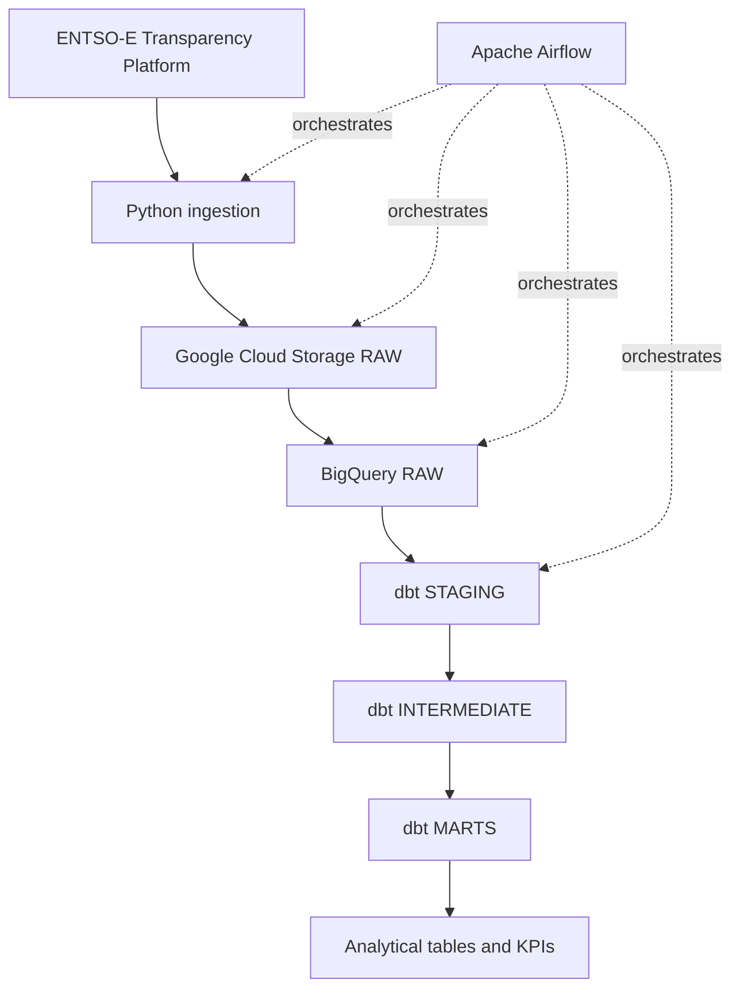

# Architecture

## Overview

European Energy Data Platform is a cloud ELT project that ingests European electricity data from the ENTSO-E Transparency Platform and transforms it into analytics-ready datasets.

The initial scope covers:

- France
- Germany
- Spain
- Italy

The MVP focuses on:

- actual electricity load;
- actual generation by production type;
- day-ahead electricity prices.

## High-level architecture



## Component responsibilities

### Python ingestion

The ingestion layer is responsible for:

- calling the ENTSO-E API for actual load, actual generation, and day-ahead prices;

- accepting explicit timezone-aware logical intervals;

- normalizing pipeline timestamps to UTC;

- validating request periods;

- applying bounded retries to transient HTTP failures;

- preserving the original XML response as bytes;

- producing deterministic RAW object paths.

Each extraction function returns an immutable `RawPayload` containing:

- `object_name`: the deterministic GCS object path;

- `content`: the unmodified source XML bytes.

This keeps extraction independent from cloud persistence and makes both layers directly testable.

### Google Cloud Storage

Google Cloud Storage is the immutable RAW landing zone.

The current bucket configuration uses:

- the `EU` multi-region;

- the `STANDARD` storage class;

- uniform bucket-level access;

- enforced public access prevention;

- a seven-day soft delete policy.

Objects use deterministic paths based on dataset, bidding zone, and logical interval:

```text
entsoe/{dataset}/bidding_zone={zone}/year=YYYY/month=MM/day=DD/
YYYYMMDDTHHMMZ_YYYYMMDDTHHMMZ.xml
```

RAW writes use the GCS precondition `if_generation_match=0`.

This means:

- the first run creates the object;

- a rerun for the same logical interval does not overwrite it;

- the first stored source payload is preserved;

- retries and backfills remain idempotent at the RAW storage layer.

The storage operation reports whether the object was created or already existed.

Real end-to-end smoke tests have validated this behavior for all three MVP datasets.

### BigQuery RAW

BigQuery RAW contains structured records parsed from the source payloads.

This layer stays close to the source representation and provides the input datasets for dbt.

The MVP uses three source-aligned tables:

- `entsoe_raw.actual_load`;
- `entsoe_raw.actual_generation`;
- `entsoe_raw.day_ahead_prices`.

The row grain is one ENTSO-E `Point` from one `Period` and one `TimeSeries`.

Each row preserves enough source metadata to trace the value back to its original document,
series, period, and immutable GCS RAW object.

Common fields include:

- source GCS object name;
- document `mRID`, type, revision number, and creation timestamp;
- TimeSeries `mRID`, business type, and curve type;
- relevant bidding-zone or domain identifiers;
- period start, period end, and resolution;
- point position;
- derived UTC point timestamp.

Dataset-specific values remain source-aligned:

- actual load stores quantity and quantity unit;
- actual generation stores quantity, quantity unit, and production `psrType`;
- day-ahead prices store price amount, currency, and price unit.

RAW parsing does not deduplicate source TimeSeries and does not synthesize missing positions.

If ENTSO-E provides two distinct TimeSeries identifiers with otherwise equivalent values, both are
preserved in RAW. Any business-level deduplication belongs to a later dbt layer with an explicit,
tested rule.

Point timestamps are derived from the period start, the point position, and the declared resolution.
A missing position therefore remains a source data gap and does not shift subsequent timestamps.

The BigQuery RAW dataset is provisioned in the `EU` location.

All three RAW tables use daily time partitioning on `point_timestamp`.

Clustering is source-aligned:

- `actual_load` clusters by `out_bidding_zone`;
- `actual_generation` clusters by `in_bidding_zone`, `out_bidding_zone`, and `psr_type`;
- `day_ahead_prices` clusters by `in_domain` and `out_domain`.

Quantities and prices use BigQuery `NUMERIC` so Python `Decimal` values do not need to pass through
binary floating-point representation.

Infrastructure provisioning creates the dataset and tables with `exists_ok=True`, making repeated
provisioning calls safe when the resources already exist.

RAW records are loaded with BigQuery load jobs using:

- explicit schemas;
- `WRITE_APPEND`;
- `CREATE_NEVER`;
- deterministic job IDs derived from the source GCS object name;
- the `EU` job location;
- explicit waiting for job completion.

If submission returns a `409 Conflict` for an existing deterministic job ID, the loader retrieves
that existing job and waits for its result instead of submitting a second load.

This protects normal retries and reruns while BigQuery retains the deterministic job metadata.
It is not a permanent row-level uniqueness constraint, so later transformation layers must still
define stable business keys where business-level deduplication is required.

Real end-to-end validation loaded and queried:

- 4 actual-load points;
- 57 actual-generation points across 15 source TimeSeries;
- 190 day-ahead-price points across two source TimeSeries.

Real reruns of all three loads kept those row counts unchanged. The day-ahead-price validation also
confirmed that the missing source position 25 remains absent rather than being synthesized.

### dbt STAGING

The staging layer provides a thin interface over the three BigQuery RAW tables.

The current models are:

- `stg_entsoe__actual_load`;

- `stg_entsoe__actual_generation`;

- `stg_entsoe__day_ahead_prices`.

They:

- reference the versioned `entsoe_raw` dbt sources;

- rename source fields into consistent analytical names;

- preserve the source row grain and UTC point timestamps;

- keep source lineage fields such as object name, document ID, and TimeSeries ID;

- avoid business-level deduplication or aggregation;

- apply `not_null` data-quality tests to required fields.

Business rules and semantic normalization are intentionally deferred to the
intermediate layer.

### dbt INTERMEDIATE

The intermediate layer contains reusable business transformations built on top
of staging.

The current models are:

- `int_entsoe__actual_generation_normalized`;

- `int_entsoe__day_ahead_prices_deduplicated`.

Generation normalization:

- derives a single analytical `bidding_zone` from the ENTSO-E input and output
  bidding-zone fields;

- derives `domain_direction` as `in`, `out`, `both`, or `none`;

- preserves the original input and output bidding-zone fields for lineage;

- validates that current source rows contain exactly one populated bidding-zone
  direction.

Day-ahead price deduplication:

- keeps RAW and staging source TimeSeries unchanged;

- identifies equivalent duplicate day-ahead observations within the same source
  object and document;

- keeps one row deterministically using the lowest `time_series_id`;

- validates that duplicated source rows are otherwise equivalent before
  deduplication;

- validates that the deduplicated business key is unique;

- validates that `in_domain` and `out_domain` are equivalent for the current
  day-ahead price source data.

The intermediate layer therefore centralizes semantic normalization and
source-specific data-quality rules without hiding inconsistencies in RAW data.

### dbt MARTS

The marts layer exposes analytics-ready fact tables at explicit business grains.

The current marts are:

- `fct_actual_load`;

- `fct_generation_by_type`;

- `fct_day_ahead_prices`.

`fct_actual_load` is built from `stg_entsoe__actual_load`.

Its analytical grain is one actual-load observation per:

- `bidding_zone`;

- `point_timestamp`.

`fct_generation_by_type` is built from
`int_entsoe__actual_generation_normalized`.

Its analytical grain is one generation observation per:

- `bidding_zone`;

- `psr_type`;

- `domain_direction`;

- `point_timestamp`.

`domain_direction` is part of the grain because current ENTSO-E data can contain
distinct `in` and `out` observations for the same bidding zone, production type,
and timestamp with different generation quantities.

`fct_day_ahead_prices` is built from
`int_entsoe__day_ahead_prices_deduplicated`.

Its analytical grain is one day-ahead price observation per:

- `bidding_zone`;

- `point_timestamp`.

The marts preserve selected lineage and source-unit fields while exposing a
smaller analytical interface than the upstream models.

Data-quality controls include:

- `not_null` tests for required analytical and lineage fields;

- singular uniqueness tests matching each mart grain.

Real BigQuery validation produced:

- 4 rows in `fct_actual_load`;

- 57 rows in `fct_generation_by_type`;

- 95 rows in `fct_day_ahead_prices`.

All 32 mart-level data tests pass against the current BigQuery data.

The three marts are physically optimized for BigQuery analytics:

- all marts use daily time partitioning on `point_timestamp`;

- `fct_actual_load` clusters by `bidding_zone`;

- `fct_generation_by_type` clusters by `bidding_zone`, `psr_type`, and
  `domain_direction`;

- `fct_day_ahead_prices` clusters by `bidding_zone`.

These settings were validated directly against the resulting BigQuery table
metadata after rebuilding the marts.

Higher-level KPIs and downstream visualizations are intentionally deferred to a
later project stage.

## Orchestration

Apache Airflow 3.3.1 orchestrates the end-to-end workflow through the
`entsoe_daily_pipeline` DAG.

The DAG is scheduled daily in UTC and uses Airflow logical data intervals.
`data_interval_start` and `data_interval_end` are passed to the application
ingestion layer instead of deriving source periods from the current wall-clock
time. This preserves deterministic reruns and supports explicit backfills.

The orchestration graph contains three dynamically mapped ingestion tasks:

- `ingest_actual_load`;
- `ingest_actual_generation`;
- `ingest_day_ahead_prices`.

Each task is mapped across the 10 configured ENTSO-E bidding zones. A single
mapped task instance handles one dataset and one bidding zone by delegating to
the application pipeline:

```text
ENTSO-E
  -> immutable GCS RAW payload
  -> XML parsing
  -> BigQuery RAW
```

The DAG therefore creates 30 mapped ingestion task instances per logical run.
The XML payload itself is not passed through Airflow XCom. Tasks return only
lightweight ingestion metadata.

After all mapped ingestion tasks succeed, `run_dbt_build` executes the dbt
transformation project:

```text
actual load [10] -----------\
actual generation [10] ------> dbt build
day-ahead prices [10] -------/
```

Runtime configuration is read only when tasks execute. DAG parsing does not
require the ENTSO-E token, GCS bucket, GCP project, or dbt dataset environment
variables. This keeps scheduler parsing and CI validation independent of cloud
credentials.

The DAG applies explicit operational controls:

- `catchup=False` to avoid automatically scheduling historical runs when the
  DAG is enabled;
- `max_active_runs=1` to prevent overlapping DAG runs;
- `max_active_tasks=3` to bound total task concurrency;
- `max_active_tis_per_dag=1` for each mapped ingestion family;
- two Airflow retries for ingestion tasks;
- one Airflow retry for the dbt task.

The three ingestion families can therefore execute concurrently, while the
bidding zones inside each family are processed one at a time. This keeps the
dynamic mapping observability without creating an unnecessary burst of
ENTSO-E API requests.

The dbt task invokes the isolated `.venv-dbt` environment and runs `dbt build`
only after the RAW ingestion branches have completed successfully.

## Idempotence strategy

Pipeline runs must be safe to execute more than once for the same logical interval.

The RAW path currently supports safe reruns through:

- explicit logical dates;
- deterministic GCS object paths;
- create-only GCS uploads using `if_generation_match=0`;
- treating an existing deterministic GCS object as a successful no-op instead of overwriting it;
- deterministic BigQuery load job IDs derived from the immutable source object name;
- recovering an existing BigQuery job after a `409 Conflict` and waiting for its result.

A real GCS rerun test confirmed that the object generation and size remain unchanged when the same
interval is processed again.

Real BigQuery rerun tests confirmed unchanged row counts for all three MVP datasets:

- actual load: 4 rows;
- actual generation: 57 rows;
- day-ahead prices: 190 rows.

The BigQuery job-ID mechanism provides retry and rerun idempotence while the deterministic job

metadata remains available in BigQuery. It does not provide permanent row-level uniqueness.

The dbt layers complement this mechanism with explicit business grains and data-quality controls.

The day-ahead intermediate model deduplicates equivalent source TimeSeries within the same source

object and document only after validating that the duplicated payloads are equivalent.

The marts then enforce their analytical grains through singular uniqueness tests. These tests do

not silently remove unexpected duplicates: they fail when the current business-grain assumptions

are violated, making source revisions or overlapping observations visible for investigation.

The current dbt marts are full table models rather than incremental or merge-based models.

## Time handling

UTC is the canonical timezone inside the pipeline.

Source resolution and time intervals must be preserved explicitly because European electricity data can contain:

- 15-minute intervals;
- 30-minute intervals;
- hourly intervals;
- daylight-saving-time transitions.

## Security

No API token, Google Cloud credential, service-account key, or local secret may be committed to Git.

Local configuration templates may be versioned through `.env.example`, but real values remain in the ignored local `.env` file.

Local Google Cloud development uses Application Default Credentials created outside the repository with:

```bash
gcloud auth application-default login
```

The GCS RAW bucket additionally enforces public access prevention and uniform bucket-level access.

## Out of scope for the initial MVP

The initial MVP intentionally excludes:

- Apache Spark;
- Kafka;
- Kubernetes;
- Dataflow;
- real-time streaming;
- Terraform;
- Looker Studio.

Terraform and Looker Studio may be introduced later only if they provide clear additional value.
