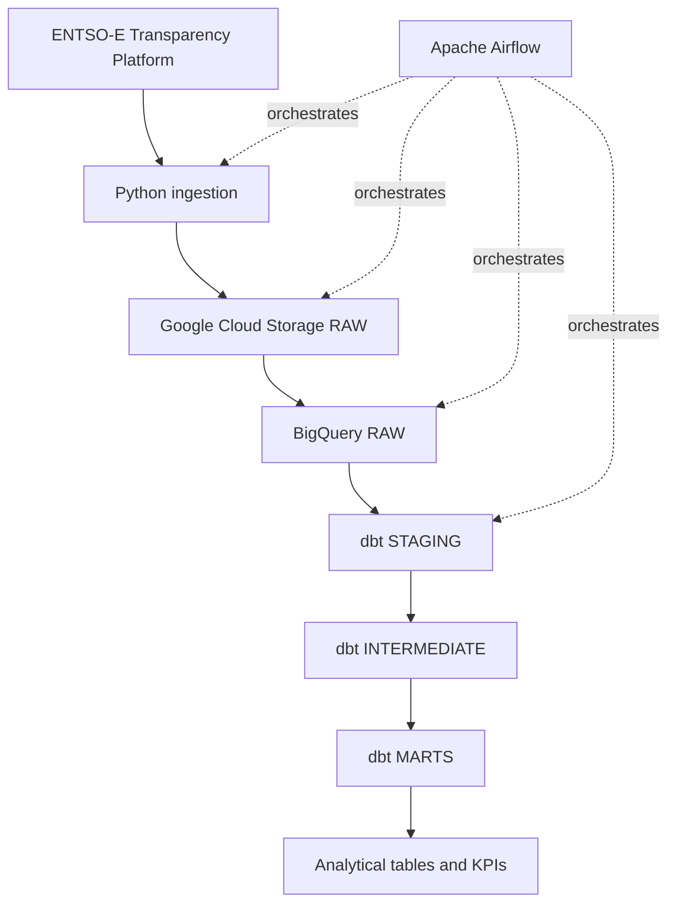

# Architecture

## Overview

European Energy Data Platform is a cloud ELT project that ingests European electricity data from the ENTSO-E Transparency Platform and transforms it into analytics-ready datasets.

The initial scope covers:

- France
- Germany
- Spain
- Italy

The MVP focuses on:

- actual electricity load;
- actual generation by production type;
- day-ahead electricity prices.

## High-level architecture



## Component responsibilities

### Python ingestion

The ingestion layer is responsible for:

- calling the ENTSO-E API for actual load, actual generation, and day-ahead prices;

- accepting explicit timezone-aware logical intervals;

- normalizing pipeline timestamps to UTC;

- validating request periods;

- applying bounded retries to transient HTTP failures;

- preserving the original XML response as bytes;

- producing deterministic RAW object paths.

Each extraction function returns an immutable `RawPayload` containing:

- `object_name`: the deterministic GCS object path;

- `content`: the unmodified source XML bytes.

This keeps extraction independent from cloud persistence and makes both layers directly testable.

### Google Cloud Storage

Google Cloud Storage is the immutable RAW landing zone.

The current bucket configuration uses:

- the `EU` multi-region;

- the `STANDARD` storage class;

- uniform bucket-level access;

- enforced public access prevention;

- a seven-day soft delete policy.

Objects use deterministic paths based on dataset, bidding zone, and logical interval:

```text
entsoe/{dataset}/bidding_zone={zone}/year=YYYY/month=MM/day=DD/
YYYYMMDDTHHMMZ_YYYYMMDDTHHMMZ.xml
```

RAW writes use the GCS precondition `if_generation_match=0`.

This means:

- the first run creates the object;

- a rerun for the same logical interval does not overwrite it;

- the first stored source payload is preserved;

- retries and backfills remain idempotent at the RAW storage layer.

The storage operation reports whether the object was created or already existed.

Real end-to-end smoke tests have validated this behavior for all three MVP datasets.

### BigQuery RAW

BigQuery RAW contains structured records parsed from the source payloads.

This layer stays close to the source representation and provides the input datasets for dbt.

### dbt STAGING

The staging layer:

- renames and standardizes source fields;
- applies basic type conversions;
- normalizes timestamps;
- exposes clean source-aligned models.

### dbt INTERMEDIATE

The intermediate layer contains reusable transformations such as:

- generation normalization;
- temporal alignment;
- country and bidding-zone mappings;
- renewable generation calculations.

### dbt MARTS

The marts layer exposes business-facing datasets such as:

- hourly country energy metrics;
- daily country energy metrics;
- monthly country energy metrics;
- electricity generation mix;
- renewable share;
- day-ahead price analysis.

## Orchestration

Apache Airflow orchestrates the end-to-end workflow.

DAGs will be designed around logical data intervals rather than the current wall-clock time.

This enables:

- scheduled daily runs;
- explicit date parameters;
- retries;
- dependency management;
- backfills;
- reproducible reruns.

## Idempotence strategy

Pipeline runs must be safe to execute more than once for the same logical interval.

The RAW layer currently guarantees idempotence through:

- explicit logical dates;

- deterministic GCS object paths;

- create-only uploads using `if_generation_match=0`;

- treating an existing deterministic object as a successful no-op instead of overwriting it.

A real GCS rerun test confirmed that the object generation and size remain unchanged when the same interval is processed again.

Future layers will extend this strategy with:

- stable business keys;

- controlled BigQuery loading strategies;

- dbt incremental or merge-based models where appropriate.

## Time handling

UTC is the canonical timezone inside the pipeline.

Source resolution and time intervals must be preserved explicitly because European electricity data can contain:

- 15-minute intervals;
- 30-minute intervals;
- hourly intervals;
- daylight-saving-time transitions.

## Security

No API token, Google Cloud credential, service-account key, or local secret may be committed to Git.

Local configuration templates may be versioned through `.env.example`, but real values remain in the ignored local `.env` file.

Local Google Cloud development uses Application Default Credentials created outside the repository with:

```bash
gcloud auth application-default login
```

The GCS RAW bucket additionally enforces public access prevention and uniform bucket-level access.

## Out of scope for the initial MVP

The initial MVP intentionally excludes:

- Apache Spark;
- Kafka;
- Kubernetes;
- Dataflow;
- real-time streaming;
- Terraform;
- Looker Studio.

Terraform and Looker Studio may be introduced later only if they provide clear additional value.
