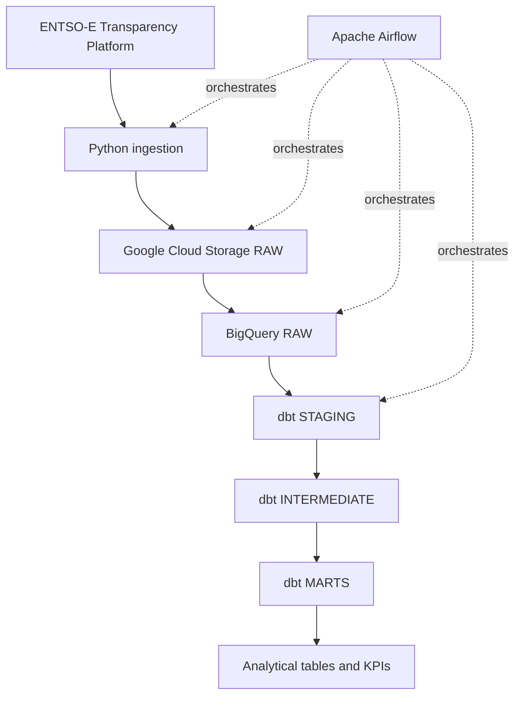

# Architecture

## Overview

European Energy Data Platform is a cloud ELT project that ingests European electricity data from the ENTSO-E Transparency Platform and transforms it into analytics-ready datasets.

The initial scope covers:

- France
- Germany
- Spain
- Italy

The MVP focuses on:

- actual electricity load;
- actual generation by production type;
- day-ahead electricity prices.

## High-level architecture



## Component responsibilities

### Python ingestion

The ingestion layer is responsible for:

- calling the ENTSO-E API for actual load, actual generation, and day-ahead prices;

- accepting explicit timezone-aware logical intervals;

- normalizing pipeline timestamps to UTC;

- validating request periods;

- applying bounded retries to transient HTTP failures;

- preserving the original XML response as bytes;

- producing deterministic RAW object paths.

Each extraction function returns an immutable `RawPayload` containing:

- `object_name`: the deterministic GCS object path;

- `content`: the unmodified source XML bytes.

This keeps extraction independent from cloud persistence and makes both layers directly testable.

### Google Cloud Storage

Google Cloud Storage is the immutable RAW landing zone.

The current bucket configuration uses:

- the `EU` multi-region;

- the `STANDARD` storage class;

- uniform bucket-level access;

- enforced public access prevention;

- a seven-day soft delete policy.

Objects use deterministic paths based on dataset, bidding zone, and logical interval:

```text
entsoe/{dataset}/bidding_zone={zone}/year=YYYY/month=MM/day=DD/
YYYYMMDDTHHMMZ_YYYYMMDDTHHMMZ.xml
```

RAW writes use the GCS precondition `if_generation_match=0`.

This means:

- the first run creates the object;

- a rerun for the same logical interval does not overwrite it;

- the first stored source payload is preserved;

- retries and backfills remain idempotent at the RAW storage layer.

The storage operation reports whether the object was created or already existed.

Real end-to-end smoke tests have validated this behavior for all three MVP datasets.

### BigQuery RAW

BigQuery RAW contains structured records parsed from the source payloads.

This layer stays close to the source representation and provides the input datasets for dbt.

The MVP uses three source-aligned tables:

- `entsoe_raw.actual_load`;
- `entsoe_raw.actual_generation`;
- `entsoe_raw.day_ahead_prices`.

The row grain is one ENTSO-E `Point` from one `Period` and one `TimeSeries`.

Each row preserves enough source metadata to trace the value back to its original document,
series, period, and immutable GCS RAW object.

Common fields include:

- source GCS object name;
- document `mRID`, type, revision number, and creation timestamp;
- TimeSeries `mRID`, business type, and curve type;
- relevant bidding-zone or domain identifiers;
- period start, period end, and resolution;
- point position;
- derived UTC point timestamp.

Dataset-specific values remain source-aligned:

- actual load stores quantity and quantity unit;
- actual generation stores quantity, quantity unit, and production `psrType`;
- day-ahead prices store price amount, currency, price unit, and the optional
  ENTSO-E `classification_sequence_position` when supplied by the source.

RAW parsing does not deduplicate source TimeSeries and does not synthesize missing positions.

If ENTSO-E provides two distinct TimeSeries identifiers with otherwise equivalent values, both are
preserved in RAW. Any business-level deduplication belongs to a later dbt layer with an explicit,
tested rule.

Point timestamps are derived from the period start, the point position, and the declared resolution.
A missing position therefore remains a source data gap and does not shift subsequent timestamps.

The BigQuery RAW dataset is provisioned in the `EU` location.

All three RAW tables use daily time partitioning on `point_timestamp`.

Clustering is source-aligned:

- `actual_load` clusters by `out_bidding_zone`;
- `actual_generation` clusters by `in_bidding_zone`, `out_bidding_zone`, and `psr_type`;
- `day_ahead_prices` clusters by `in_domain` and `out_domain`.

Quantities and prices use BigQuery `NUMERIC` so Python `Decimal` values do not need to pass through
binary floating-point representation.

Infrastructure provisioning creates the dataset and tables with `exists_ok=True`, making repeated
provisioning calls safe when the resources already exist.

RAW records are loaded with BigQuery load jobs using:

- explicit schemas;
- `WRITE_APPEND`;
- `CREATE_NEVER`;
- deterministic job IDs derived from the source GCS object name;
- the `EU` job location;
- explicit waiting for job completion.

If submission returns a `409 Conflict` for an existing deterministic job ID, the loader retrieves
that existing job and waits for its result instead of submitting a second load.

This protects normal retries and reruns while BigQuery retains the deterministic job metadata.
It is not a permanent row-level uniqueness constraint, so later transformation layers must still
define stable business keys where business-level deduplication is required.

Real end-to-end validation loaded and queried:

- 4 actual-load points;
- 57 actual-generation points across 15 source TimeSeries;
- 190 day-ahead-price points across two source TimeSeries.

Real reruns of all three loads kept those row counts unchanged. The day-ahead-price validation also
confirmed that the missing source position 25 remains absent rather than being synthesized.

### dbt STAGING

The staging layer provides a thin interface over the three BigQuery RAW tables.

The current models are:

- `stg_entsoe__actual_load`;

- `stg_entsoe__actual_generation`;

- `stg_entsoe__day_ahead_prices`.

They:

- reference the versioned `entsoe_raw` dbt sources;

- rename source fields into consistent analytical names;

- preserve the source row grain and UTC point timestamps;

- keep source lineage fields such as object name, document ID, and TimeSeries ID;

- avoid business-level deduplication or aggregation;

- apply `not_null` data-quality tests to required fields.

Business rules and semantic normalization are intentionally deferred to the
intermediate layer.

### dbt INTERMEDIATE

The intermediate layer contains reusable business transformations built on top
of staging.

The current models are:

- `int_entsoe__actual_load_canonical`;

- `int_entsoe__actual_generation_normalized`;

- `int_entsoe__actual_generation_canonical`;

- `int_entsoe__day_ahead_prices_deduplicated`;

- `int_entsoe__day_ahead_prices_canonical`.

Generation normalization:

- derives a single analytical `bidding_zone` from the ENTSO-E input and output
  bidding-zone fields;

- derives `domain_direction` as `in`, `out`, `both`, or `none`;

- preserves the original input and output bidding-zone fields for lineage;

- validates that current source rows contain exactly one populated bidding-zone
  direction.

Day-ahead price deduplication:

- keeps RAW and staging source TimeSeries unchanged;

- identifies equivalent duplicate day-ahead observations within the same source
  object and document, with `classification_sequence_position` included in the
  business grain when present;

- keeps one row deterministically using the lowest `time_series_id`;

- validates that duplicated source rows are otherwise equivalent before
  deduplication;

- validates that `in_domain` and `out_domain` are equivalent for the current
  day-ahead price source data.

Cross-source canonicalization is applied after source-specific normalization or
deduplication. It resolves overlapping immutable extracts to one analytical row
per declared business grain.

For all three datasets, canonical rows are selected deterministically by:

1. highest ENTSO-E `revision_number`;
2. most recent `document_created_at`;
3. deterministic source object, document, and TimeSeries tie-breakers.

The canonical business grains are:

- actual load: `bidding_zone` and `point_timestamp`;
- actual generation: `bidding_zone`, `psr_type`, `domain_direction`, and
  `point_timestamp`;
- day-ahead prices: `in_domain`, `classification_sequence_position`, and
  `point_timestamp`.

Singular tests verify that each canonical intermediate model is unique at its
declared grain.

This design keeps the immutable RAW history intact while ensuring downstream
analytics consume one deterministic version of overlapping observations.

### dbt MARTS

The marts layer exposes analytics-ready fact tables and daily KPI aggregates at
explicit business grains.

The fact marts are:

- `fct_actual_load`;
- `fct_generation_by_type`;
- `fct_day_ahead_prices`.

`fct_actual_load` is built from `int_entsoe__actual_load_canonical`.

Its analytical grain is one actual-load observation per:

- `bidding_zone`;
- `point_timestamp`.

`fct_generation_by_type` is built from
`int_entsoe__actual_generation_canonical`.

Its analytical grain is one generation observation per:

- `bidding_zone`;
- `psr_type`;
- `domain_direction`;
- `point_timestamp`.

`domain_direction` remains part of the grain because ENTSO-E data can contain
distinct `in` and `out` observations for the same bidding zone, production
type, and timestamp.

`fct_day_ahead_prices` is built from
`int_entsoe__day_ahead_prices_canonical`.

Its analytical grain is one day-ahead price observation per:

- `bidding_zone`;
- `classification_sequence_position`;
- `point_timestamp`.

`classification_sequence_position` is nullable because ENTSO-E does not expose
it for every day-ahead TimeSeries. When present, it distinguishes parallel
auction series that can contain different prices at the same timestamp.

It also exposes `period_start` and `period_end` so downstream price aggregates
can retain the ENTSO-E delivery-period semantics rather than grouping prices
naively by UTC calendar date.

The daily KPI marts are:

- `agg_daily_load`;
- `agg_daily_generation_by_type`;
- `agg_daily_day_ahead_prices`.

`agg_daily_load` has one row per:

- `bidding_zone`;
- UTC `observation_date`.

It exposes average, minimum, and maximum load, the timestamp of peak load,
observed energy in MWh, observed and expected interval counts, a coverage
ratio, and an explicit complete-day flag.

`agg_daily_generation_by_type` has one row per:

- `bidding_zone`;
- UTC `observation_date`;
- `psr_type`;
- `domain_direction`.

It exposes equivalent generation statistics and observed energy while keeping
partial production series visible through the same coverage indicators.

For load and generation, interval duration is derived from the ENTSO-E
resolution. Observed energy is computed from the available power observations
and their interval duration. Missing observations are not interpolated or
silently treated as a complete day.

`agg_daily_day_ahead_prices` has one row per:

- `bidding_zone`;
- `classification_sequence_position`;
- ENTSO-E `delivery_date`.

The delivery date is derived from the source delivery period rather than
`date(point_timestamp)`. This is required because a European day-ahead
delivery period can cross UTC date boundaries.

The price aggregate exposes:

- average, minimum, and maximum EUR/MWh price;
- count and duration of negative-price intervals;
- observed and expected interval counts;
- coverage ratio;
- an explicit complete-delivery-day flag.

The expected price interval count is derived from `period_start`, `period_end`,
and the source resolution rather than being hard-coded to 96 intervals. This
keeps the model compatible with delivery periods whose duration changes around
daylight-saving-time transitions.

Data-quality controls across marts include:

- `not_null` tests for required analytical and lineage fields;
- singular uniqueness tests matching every declared fact and aggregate grain;
- metric-validity tests for coverage bounds, interval counts, min/average/max
  ordering, completeness flags, energy values, peak timestamps, and
  negative-price metrics.

The complete dbt project currently defines 14 models, 149 data tests, and
3 sources.

Real BigQuery validation produced:

- 96 canonical load observations in `fct_actual_load`;
- 1,389 canonical generation observations in `fct_generation_by_type`;
- 191 canonical price observations in an earlier France overlap validation;
- distinct DE-LU fact rows for classification sequence positions 1 and 2 at the
  same timestamps after multi-zone runtime validation;
- one France row in `agg_daily_load` for 2026-08-20 with 96/96 intervals,
  coverage 1.0, and 1,032,628.53 MWh of observed energy;
- 15 France rows in `agg_daily_generation_by_type` for 2026-08-20, including
  partial groups at 75/96, 92/96, and 70/96 intervals;
- two France rows in `agg_daily_day_ahead_prices`, with delivery-period
  coverage of 95/96 and 96/96 intervals;
- separate DE-LU daily price rows per classification sequence position, including
  complete 96/96 series and an independently preserved partial 94/96 series.

Targeted real dbt builds of all three daily KPI marts and their associated tests
completed successfully.

A subsequent full real `dbt build` also completed successfully with 6 table
models, 8 view models, and 149 data tests. The final result was `PASS=163`,
`WARN=0`, `ERROR=0`, and `SKIP=0`.

The fact marts are physically optimized with daily partitioning on
`point_timestamp` and source-appropriate clustering.

The daily KPI marts are physically optimized with daily partitioning on
`observation_date` or `delivery_date` and clustering by their leading business
dimensions.

Downstream visualization remains an optional later project stage.

## Orchestration

Apache Airflow 3.3.1 orchestrates the end-to-end workflow through the
`entsoe_daily_pipeline` DAG.

The DAG uses an explicit `CronDataIntervalTimetable` with a daily UTC
schedule. This guarantees a 24-hour logical data interval independently of the
global Airflow `scheduler.create_cron_data_intervals` configuration.

`data_interval_start` and `data_interval_end` are passed to the application
ingestion layer instead of deriving source periods from the current wall-clock
time. This preserves deterministic reruns and supports explicit backfills.

The orchestration graph contains three dynamically mapped ingestion tasks:

- `ingest_actual_load`;
- `ingest_actual_generation`;
- `ingest_day_ahead_prices`.

Each task is mapped across the 10 configured ENTSO-E bidding zones. A single
mapped task instance handles one dataset and one bidding zone by delegating to
the application pipeline:

```text
ENTSO-E
  -> immutable GCS RAW payload
  -> XML parsing
  -> BigQuery RAW
```

The DAG therefore creates 30 mapped ingestion task instances per logical run.
The XML payload itself is not passed through Airflow XCom. Tasks return only
lightweight ingestion metadata.

After all mapped ingestion tasks succeed, `run_dbt_build` executes the dbt
transformation project:

```text
actual load [10] -----------\
actual generation [10] ------> dbt build
day-ahead prices [10] -------/
```

Runtime configuration is read only when tasks execute. DAG parsing does not
require the ENTSO-E token, GCS bucket, GCP project, or dbt dataset environment
variables. This keeps scheduler parsing and CI validation independent of cloud
credentials.

The DAG applies explicit operational controls:

- `catchup=False` to avoid automatically scheduling historical runs when the
  DAG is enabled;
- `max_active_runs=1` to prevent overlapping DAG runs;
- `max_active_tasks=3` to bound total task concurrency;
- `max_active_tis_per_dag=1` for each mapped ingestion family;
- two Airflow retries for ingestion tasks;
- one Airflow retry for the dbt task.

The three ingestion families can therefore execute concurrently, while the
bidding zones inside each family are processed one at a time. This keeps the
dynamic mapping observability without creating an unnecessary burst of
ENTSO-E API requests.

The dbt task invokes the isolated `.venv-dbt` environment and runs `dbt build`
only after the RAW ingestion branches have completed successfully.

Runtime validation has exercised each of the three ingestion task families for
France and the downstream `run_dbt_build` task. This validates the task-level
Airflow integration without claiming that a complete 30-task mapped DAG run has
been executed.

## Idempotence strategy

Pipeline runs must be safe to execute more than once for the same logical
interval while preserving source history.

The RAW path currently supports safe reruns through:

- explicit logical dates;
- deterministic GCS object paths;
- create-only GCS uploads using `if_generation_match=0`;
- treating an existing deterministic GCS object as a successful no-op instead
  of overwriting it;
- deterministic BigQuery load job IDs derived from the immutable source object
  name;
- recovering an existing BigQuery job after a `409 Conflict` and waiting for
  its result.

A real GCS rerun test confirmed that the object generation and size remain
unchanged when the same interval is processed again.

The BigQuery job-ID mechanism protects normal retries while deterministic job
metadata remains available. It is not a permanent row-level uniqueness
constraint, and distinct immutable source objects may legitimately cover
overlapping business intervals.

The dbt layers therefore resolve business-level overlap explicitly rather than
deleting or mutating RAW history.

Day-ahead prices first remove equivalent duplicate TimeSeries within the same
source object and document after validating that those values are equivalent.
The optional ENTSO-E `classification_sequence_position` is part of that business
grain so parallel auction series are not incorrectly collapsed.

All three datasets then apply cross-source canonicalization at their declared
business grain. The preferred row is selected by highest `revision_number`,
then most recent `document_created_at`, followed by deterministic technical
tie-breakers.

Real validation with overlapping one-hour and full-day source objects confirmed
that the overlapping observations contained no conflicting values. The
canonicalization reduced:

- actual load from 100 staged rows to 96 canonical rows;
- actual generation from 1,446 normalized rows to 1,389 canonical rows;
- day-ahead prices from 286 deduplicated rows to 191 canonical rows in the
  earlier France overlap validation.

Subsequent multi-zone validation exposed parallel DE-LU TimeSeries with different
prices at identical timestamps. Preserving `classification_sequence_position`
resolved all 190 non-equivalent legacy-grain collisions observed in that source
object while retaining equivalent duplicates where the classification is absent.

Canonical intermediate models and marts both have singular uniqueness tests.
Unexpected duplicates therefore remain visible as data-quality failures if the
canonical business assumptions stop holding.

The current dbt marts are full table models rather than incremental or
merge-based models.

## Time handling

UTC is the canonical timezone inside the pipeline.

Source resolution and time intervals must be preserved explicitly because European electricity data can contain:

- 15-minute intervals;
- 30-minute intervals;
- hourly intervals;
- daylight-saving-time transitions.

## Security

No API token, Google Cloud credential, service-account key, or local secret may be committed to Git.

Local configuration templates may be versioned through `.env.example`, but real values remain in the ignored local `.env` file.

Local Google Cloud development uses Application Default Credentials created outside the repository with:

```bash
gcloud auth application-default login
```

The GCS RAW bucket additionally enforces public access prevention and uniform bucket-level access.

## Out of scope for the initial MVP

The initial MVP intentionally excludes:

- Apache Spark;
- Kafka;
- Kubernetes;
- Dataflow;
- real-time streaming;
- Terraform;
- Looker Studio.

Terraform and Looker Studio may be introduced later only if they provide clear additional value.
