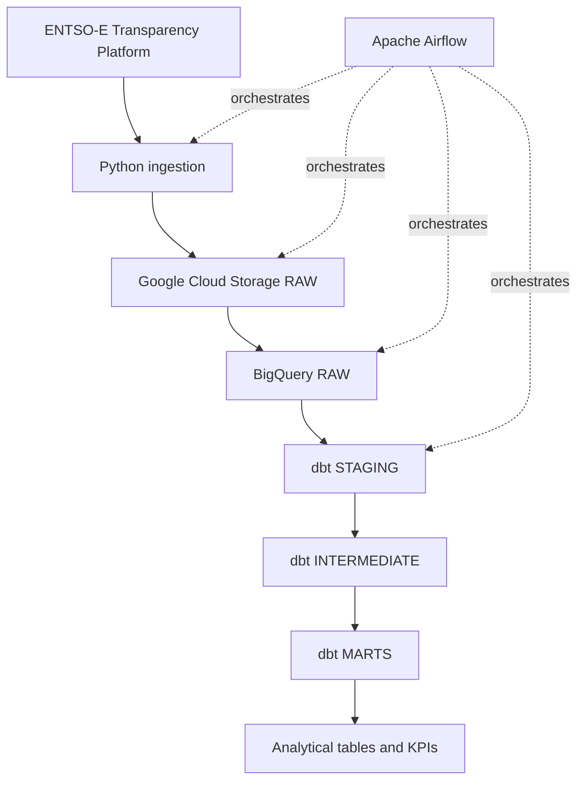

# Architecture

## Overview

European Energy Data Platform is a cloud ELT project that ingests European electricity data from the ENTSO-E Transparency Platform and transforms it into analytics-ready datasets.

The initial scope covers:

- France
- Germany
- Spain
- Italy

The MVP focuses on:

- actual electricity load;
- actual generation by production type;
- day-ahead electricity prices.

## High-level architecture

## Component responsibilities

### Python ingestion

The ingestion layer is responsible for:

- calling the ENTSO-E API;
- accepting explicit date parameters;
- handling API errors and retries;
- validating source responses;
- preserving raw source payloads;
- producing deterministic output paths.

### Google Cloud Storage

Google Cloud Storage is the raw landing zone.

Raw source payloads are preserved before transformation so that historical data can be reprocessed without unnecessarily calling the external API again.

### BigQuery RAW

BigQuery RAW contains structured records parsed from the source payloads.

This layer stays close to the source representation and provides the input datasets for dbt.

### dbt STAGING

The staging layer:

- renames and standardizes source fields;
- applies basic type conversions;
- normalizes timestamps;
- exposes clean source-aligned models.

### dbt INTERMEDIATE

The intermediate layer contains reusable transformations such as:

- generation normalization;
- temporal alignment;
- country and bidding-zone mappings;
- renewable generation calculations.

### dbt MARTS

The marts layer exposes business-facing datasets such as:

- hourly country energy metrics;
- daily country energy metrics;
- monthly country energy metrics;
- electricity generation mix;
- renewable share;
- day-ahead price analysis.

## Orchestration

Apache Airflow orchestrates the end-to-end workflow.

DAGs will be designed around logical data intervals rather than the current wall-clock time.

This enables:

- scheduled daily runs;
- explicit date parameters;
- retries;
- dependency management;
- backfills;
- reproducible reruns.

## Idempotence strategy

Pipeline runs must be safe to execute more than once for the same logical interval.

The project will use:

- deterministic raw object paths;
- explicit logical dates;
- stable business keys;
- controlled BigQuery loading strategies;
- dbt incremental or merge-based models where appropriate.

The precise implementation will be defined when each pipeline layer is developed.

## Time handling

UTC is the canonical timezone inside the pipeline.

Source resolution and time intervals must be preserved explicitly because European electricity data can contain:

- 15-minute intervals;
- 30-minute intervals;
- hourly intervals;
- daylight-saving-time transitions.

## Security

No API token, Google Cloud credential, service-account key, or local secret may be committed to Git.

Local configuration templates may be versioned through files such as `.env.example`, but real values must remain outside the repository.

## Out of scope for the initial MVP

The initial MVP intentionally excludes:

- Apache Spark;
- Kafka;
- Kubernetes;
- Dataflow;
- real-time streaming;
- Terraform;
- Looker Studio.

Terraform and Looker Studio may be introduced later only if they provide clear additional value.
